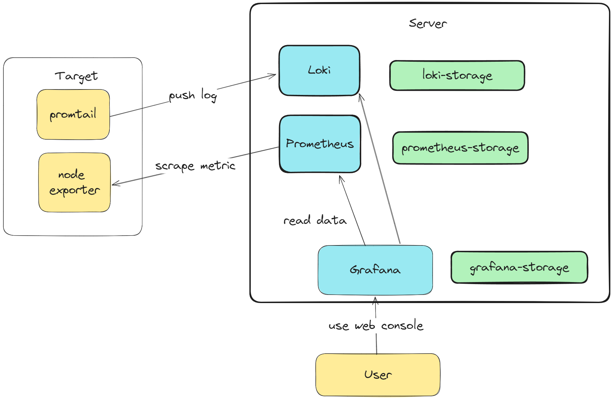

# monitoring-prototype

This is a monolithic service that contains [Grafana](https://grafana.com/), [Prometheus](https://prometheus.io/) and [Loki](https://grafana.com/oss/loki/). All data storage and process are located in same node. It allows a quick setup for establishing observability for a small system or for a testing purpose. However, this is only a prototype and should not be used in production. For that, you will have to deploy these services in a distributed manner to ensure high availability and scalability. Here is a brief diagram of the architecture:



## **Prerequisites**

First, ensure that you are using a machine meeting the following requirements:

- Have `docker` and `docker-compose` installed.
- If you want to run locally, you need to have `node` 20.11 and `npm` installed.
- Have a keyboard for you to type command.
- Chill enough.

## **Configuration**

Create an `.env` file in the root directory of the project. Docker will read the env variable from this file. This file is not committed to the repository and is used to store sensitive information such as API keys and secrets. You can find a sample of the `.env` file in the `.env.example` file.

Make any change to the following files if you want to customize the configuration:
- `./prometheus/prometheus.yml`: Prometheus configuration file.
- `./grafana/grafana.ini`: Grafana configuration file.
- `./grafana/provisioning/*`: Provisioning files for Grafana.
- `./loki/loki.yaml`: Loki configuration file.

## **Run**

Run `docker-compose build` and `docker-compose up -d` to run the tool.
Docker will read environment variables from the `.env` file and use them to configure the application.

Now you can access the following services:
- Login to Grafana Console at http://[YOUR_HOST_IP]:3000
- View Prometheus Status at http://[YOUR_HOST_IP]:9090
- Send logs to Loki API at http://[YOUR_HOST_IP]:3100


## **Client Setup**

On the client side, you have to setup the following components:
- Loki is **push based** logging system. Use tools like Promtail to push logs to Loki. You can find the setup guide [here](./client-examples/promtail-linux-ec2/README.md)
- Prometheus is **pull based** monitoring system. Ue Node Exporter to expose machine level metrics to Prometheus. You can find the setup guide [here](./client-examples/prometheus-node-exporter-linux/README.md).


## **Hot Reload Proemtheus Configuration**

Sometimes, you want to add target machine for Prometheus to scrape and thus need to update the Prometheus configuration file `./prometheus/premetheus.yaml`. In this case, we do not need to restart the Prometheus process.
 To do this, you have to first start your Prometheus process with `--web.enable-lifecycle` flag. After starting with this flag, then you can hit the below URL every time you want to reload your config changes.

```
curl -X POST <your_prometheus_server_url>:<port>/-/reload
```

For frequently changed target, it's recommended to use file service discovery. You can find more information [here](https://prometheus.io/docs/prometheus/latest/configuration/configuration/#file_sd_config).


## **Backup & Restore Data**

All data are stored in Docker Volumes. If you need to backup data, please refer to [Docker Volume Backup](https://docs.docker.com/engine/storage/volumes/#back-up-restore-or-migrate-data-volumes).
